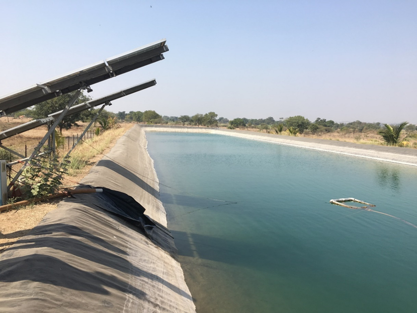

{width="8.635416666666666in" height="6.479166666666667in"}

**Technical paradigms in electricity supply for irrigation pumps: Case of**

**Maharashtra, India**

Preprint of the paper here.

*Journal website:* [*[Energy for Sustainable Development 58 (2020): 50-62.]{.underline}*](https://doi.org/10.1016/j.esd.2020.07.005)

**Authors: Priya Jadhav, Namita Sawant, Athira Madhusudhana Panicker**

State governments have historically, and continue to, invest in power distribution infrastructure for irrigation pumps. Many new models such as offgrid solar PV Pumps, HVDS (High Voltage Distribution Systems), and solar Ag feeders continue to be implemented to varying extents by states in the country.

This work was the first to do a techno-economic comparison of the various models through a systemic lens. A marginal price of electricity separating out the distribution infrastructure and energy costs was considered for the grid based system. It was found that a minimum 875 hours of pumping is required for offgrid solar pumps to be cost-effective compared to grid based pumps. This is not the case for most farmers in Maharashtra.

An invited talk, which was very well received, was made at the Maharashtra Electricity Regulatory Commission on 31st August 2020. A copy of the presentation can be found [[here]{.underline}](https://drive.google.com/file/d/1W7J4FRwbqVsM-PDizykz5ShE8ryhZtEH/view?usp=drive_link).
