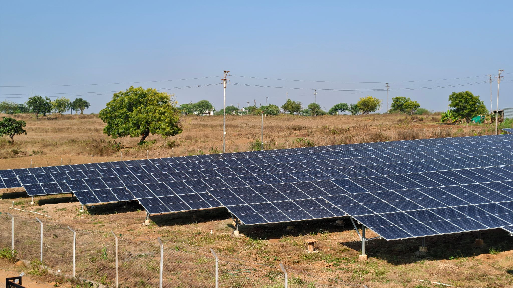

Agency: District Collector, Dharashiv

August 2025 - Ongoing

Team: Shashwata Swarupa Sahoo (PhD), Tejas Nagotkar, Keshav Reddy (MTech)

[The central government is promoting the establishment of 2 - 8 MW scale renewable energy projects connected to Agricultural feeders. This approach results in renewable capacity development with the possibility of providing day time supply to all farmers with potentially lower requirement of distribution/transmission infrastructure enhancement. The scheme is also (a) allowing farmers to be community owners of the projects (b) allows farmers the opportunity to lease/sell agricultural land for a remunerative price.]{.mark}

[Reliable and low cost energy, or electrical power, is an important enabler in agricultural, industrial development, and for basic amenities for society. Also, the current renewable energy focus on small / medium sized solar PV and wind power plants is creating opportunities as well as challenges for people in rural areas.]{.mark}

[This project conducts the study and analysis of the implementation of the scheme in Dharashiv. The study will focus on project management processes, efficiency, coverage and overall benefits. Other attributes may be added as per discussions with district administration]{.mark}

{width="6.385416666666667in" height="3.3868121172353454in"}[\
Shahapur Solar Power Plant (4 MW) setup under MSKVY scheme]{.mark}
