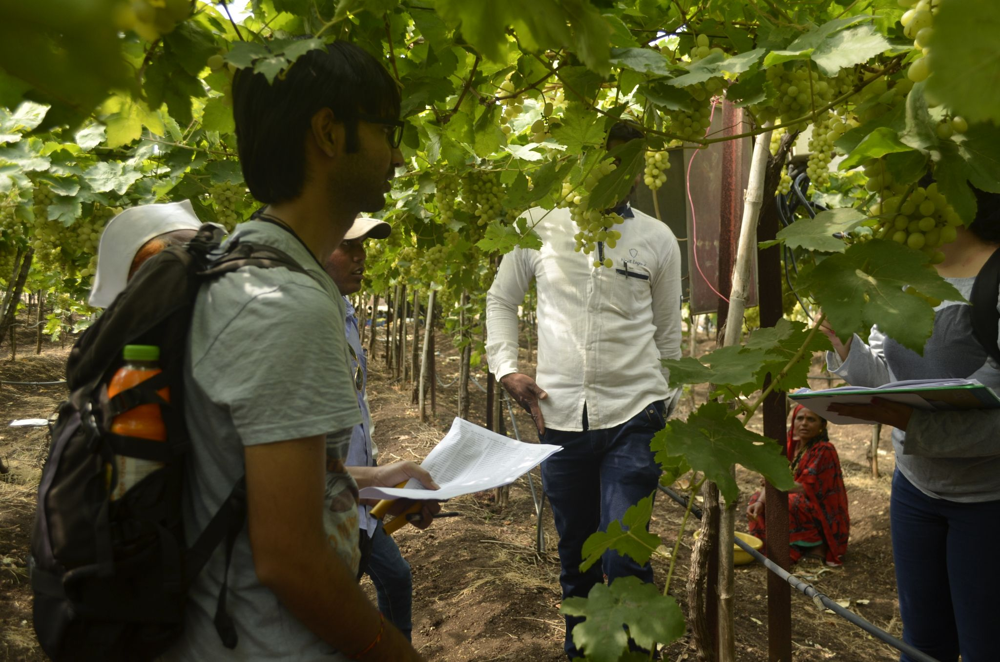
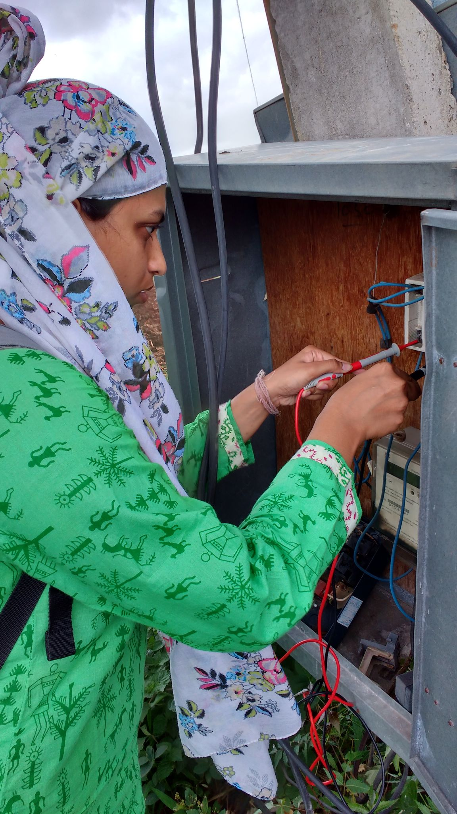

**Study to examine agricultural consumption in Maharashtra**

Agency: Maharashtra State Electricity Distribution Company Ltd. (Mahavitaran)

2015 - 16

Agricultural loads are a large part of MSEDCL consumers, comprising 25 to 30% of the total energy consumption. There are several issues with the current situation with regard to agricultural energy consumption measurement. Though 67% of the pumps are supposed to be metered, and the rest billed on a flat rate, metering is in fact in a poor state for all consumers. Over the years doubts have been expressed over agricultural energy consumption numbers. There have been repeated demands from the MERC for a rigorous study to determine specific consumption \[Ref: Case 19 of 2012, Case 100 of 2011\].

Hence the distribution company, Maharashtra State Electricity Distribution Company Ltd. (MSEDCL), commissioned a study to develop a protocol for energy consumption estimation in the state.

The study was conducted on a sample set of 100 feeders in the state. 15 engineering colleges across the state of Maharashtra were engaged in a collaborative exercise (see table below)

The estimated energy consumption for 2015-15 resulted in changes in MSEDCL energy accounting, and the study was quoted and used in regulatory commission hearings: [[Case No. 48 of 2016 (November 2016)]{.underline}](https://drive.google.com/file/d/1MJiFYlm3vKW1ELe36NIwampHBdSfo_0M/view?usp=drive_link), and [[Case No. 176 of 2016 (November 2017)]{.underline}](https://drive.google.com/file/d/1mmlWda4sWx7lQ-la7rovfu3Au3La-GkD/view?usp=drive_link).

**Colleges involved in the project**

+-------------------------------------------------------------------------+
| > • Mauli College of Engineering and Technology, Shegaon                |
+-------------------------------------------------------------------------+
| > • Government engineering college of Aurangabad, Aurangabad            |
+-------------------------------------------------------------------------+
| > • Someshwar Engineering College, Someshwar                            |
+-------------------------------------------------------------------------+
| > • Karmayogi Engineering College Shelve, Pandharpur                    |
+-------------------------------------------------------------------------+
| > • Rajarambapu Institue of Technology, Islampur, Sangli                |
+-------------------------------------------------------------------------+
| > • Government College of Engineering, Jalgaon                          |
+-------------------------------------------------------------------------+
| > • BAIF Development Research Foundation, Pune                          |
+-------------------------------------------------------------------------+
| > • MBES, College of Engineering, Ambajogai                             |
+-------------------------------------------------------------------------+
| > • Nagesh Karajagi Orchid College of Engineering & Technology, Solapur |
+-------------------------------------------------------------------------+
| > • SGGS Institute of Engineering and Technology, Nanded                |
+-------------------------------------------------------------------------+
| > • K. K. Wagh Institute of Engineering Education & Research, Nasik     |
+-------------------------------------------------------------------------+
| > • CoEP, Pune                                                          |
+-------------------------------------------------------------------------+
| > • VNIT, Nagpur                                                        |
+-------------------------------------------------------------------------+
| > • Government College, Arvi                                            |
+=========================================================================+

{width="21.333333333333332in" height="14.125in"}

**IIT Bombay team surveying farmers on the Old Dawachwadi feeder, Niphad block, Nashik**

{width="4.407752624671916in" height="7.82207239720035in"}

**Power measurements at a pump**
