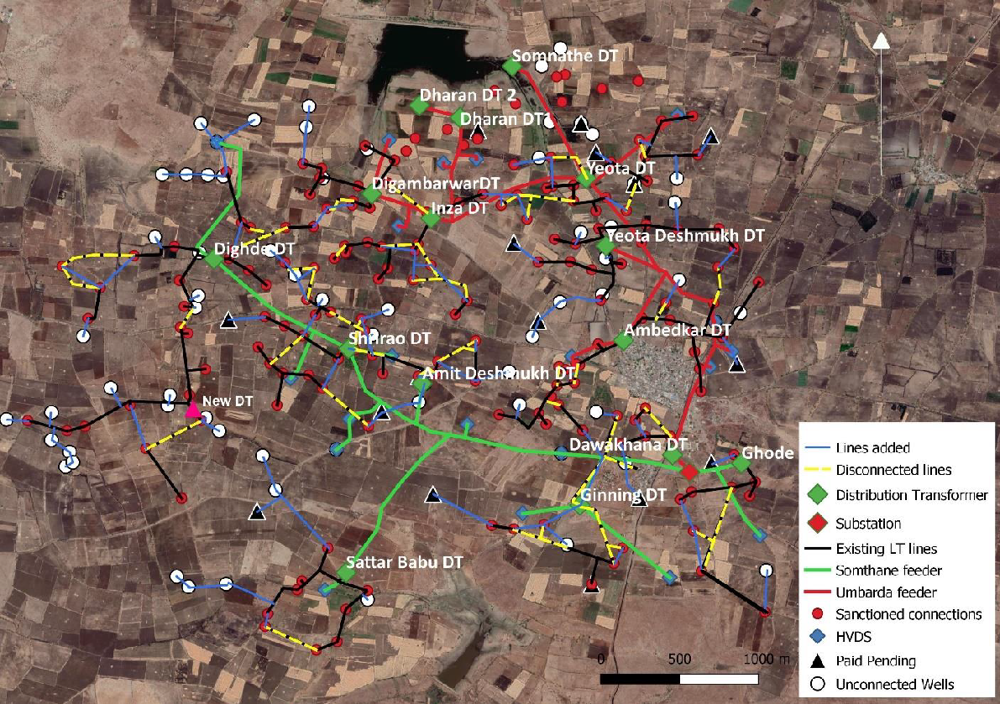
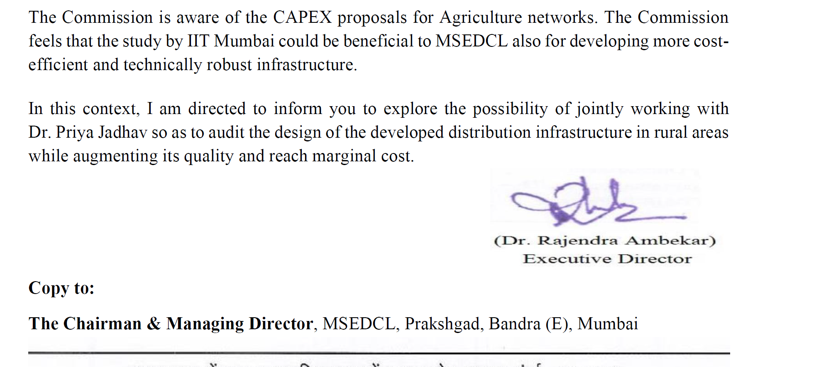

# **[Restructuring of Low Tension Distribution Network]{.mark}** 

**[Done as a part of the Project on Climate Resilient Agriculture, a project of the Dept. of Agriculture, Gov. of Maharashtra and the World Bank]{.mark}**

**[Academic work: MTech project, Prathamesh Anatarkar, 2020 - 21]{.mark}**

[**[[Download report.]{.underline}]{.mark}**](https://drive.google.com/file/d/1tAKDKAgN0UqdYC0eg_rwfcwzHlncjIAE/view?usp=drive_link)

[The government spends significantly on power distribution networks for irrigation, yet farmers continue to suffer from poor electricity supply and long wait times for new connections.]{.mark}

[The distribution network has developed over the years, with farmers digging wells as needed. This can lead to haphazard growth resulting in suboptimal network configurations.A new approach is envisaged to restructure the network to ensure a good quality power supply. This includes moving existing low-tension lines, thereby minimizing the cost of new infrastructure.]{.mark} A feasibility study in Umbarda Village, Washim led to one-third of the cost of the new connection, improved voltage profile and even loading of transformers.

The Maharashtra Electricity Regulatory Commission (MERC) referred the study to MSEDCL for uptake. ([[Recommendation here]{.underline}](https://drive.google.com/file/d/14iDFhpDnnQoU79X6pYtnmD1FX_U2Ku6N/view?usp=drive_link).)

{width="6.651042213473316in" height="4.693421916010498in"}

{width="5.256286089238845in" height="2.3215266841644793in"}
