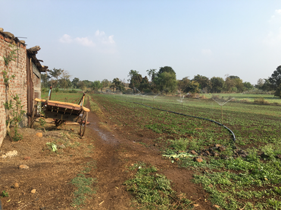
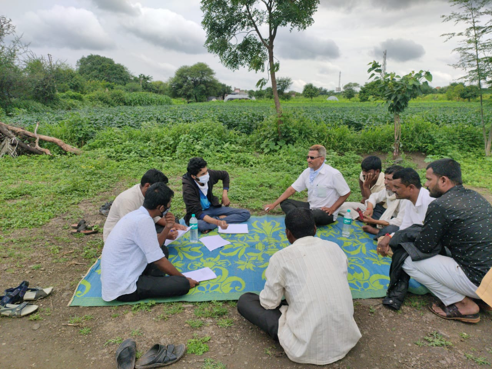

**Project on Climate Resilient Agriculture - IIT Bombay (Energy projects)**

*[Agency: Project on Climate Resilient Agriculture, a project of the Dept. of Agriculture, Gov. of Maharashtra and the World Bank]{.mark}*

2020 - 2024

Project team: Vivek Shinde, Devanand Doifode, Sameer Kulkarni, Kiran Doifode, Parasharam Akhare, Siddhesh Mane, Abhishek Khaire, Vaibhav Dound, Amol Budhwat, Shubham Bankhele, Vinayak Kamat

Students: Namita Sawant, Athira Madhusudhana Panicker, Prathamesh Antarkar

The 'Project on Climate Resilient Agriculture' (PoCRA) or Nanji Deshmukh Sanjeevani Krishi Prakalp is a project implemented by the Department of Agriculture, Government of Maharashtra (MahaPoCRA, 2017), funded by the World Bank to enhance climate-resilience and profitability of smallholder farming systems. The first phase of this project was carried out from 2017 to 2024 in 5000 villages of 15 districts in the divisions of Marathwada and West Vidarbha.

IIT Bombay worked with PoCRA on solutions for reliable access to water, and electricity for irrigation. Prof. Milind Sohoni was the Principal Investigator for the duration of the project. The MoUs between IIT Bombay and PoCRA, reports and solutions submitted are available [[here]{.underline}](https://www.cse.iitb.ac.in/~pocra/).

The energy team led by co-Principal Investigator Prof. Priya Jadhav worked on the project from 2020. The main reports and solutions of the energy team are listed below.

(Links to various project pages:

> Restructuring of Low Tension Agricultural distribution networks

Efficient irrigation pumps - context of pressurized irrigation

Modelling of Energy - Water - Crops linkage

> Demand modelling of irrigation energy demand

Distribution Transformer Capacity

Capacitors ...

Load Management Initiative

> Irrigation Investment Indices

)

{width="3.1424431321084865in" height="2.3568186789151357in"}

***Sprinklers being used in a field in Yehala, Yavatmal***

{width="3.3177088801399823in" height="2.49549321959755in"}

Focused Group Discussion with farmers
