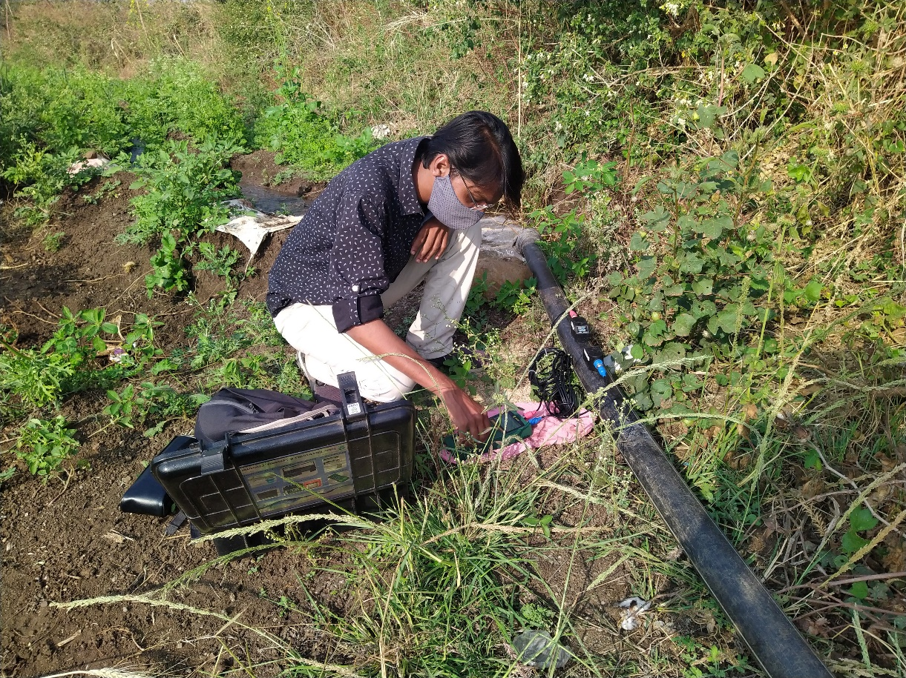
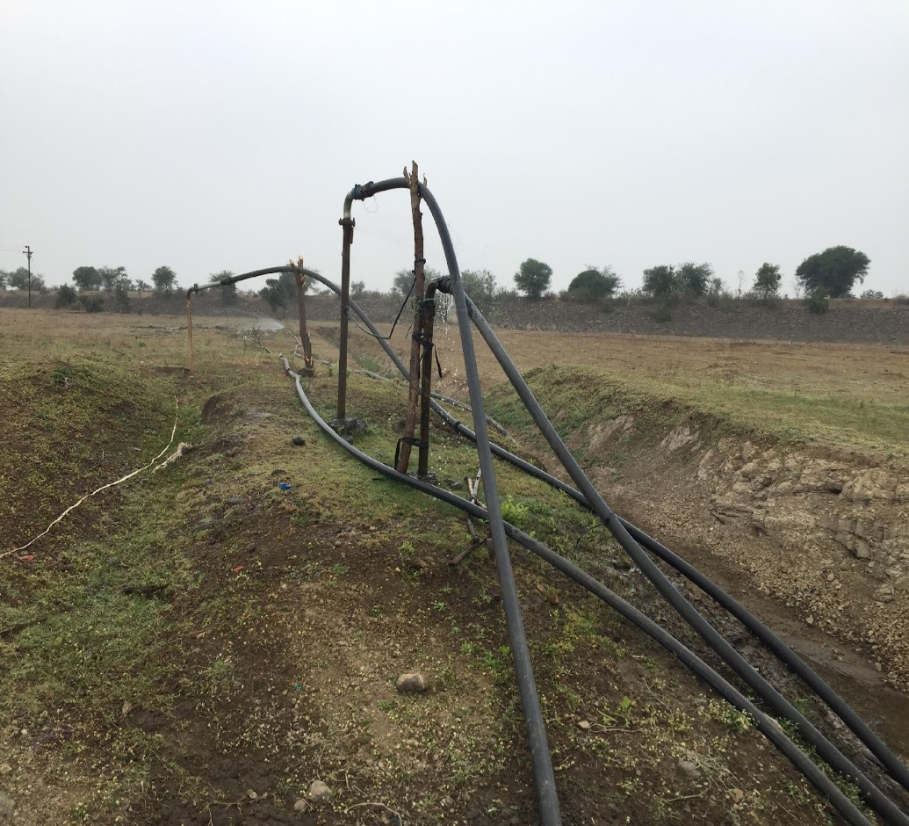
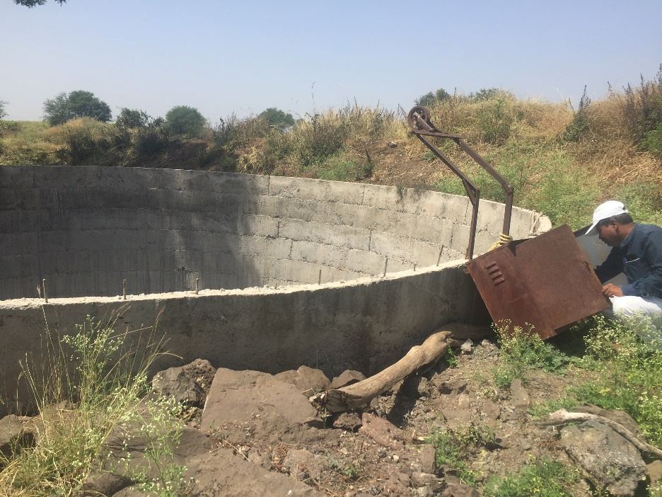

**Appropriate pump selection and Efficiency in irrigation pumping**

**[Done as a part of the Project on Climate Resilient Agriculture, a project of the Dept. of Agriculture, Gov. of Maharashtra and the World Bank.]{.mark}**

[**[[Download Report]{.underline}]{.mark}**](https://drive.google.com/file/d/1YBSQzDIRYmVWGHUbk2rJYaCbouf-JfJS/view?usp=drive_link)

[**Academic work in the area:** MTech project: Investigating Agriculture Demand Side Management through ESCO -- (A case study of Solapur Pump replacement Project) Saurabh Khobragade, 2017 - 2018. [**[Download report.]{.underline}**](https://drive.google.com/file/d/15TkB_4OxIvCzXOpBfz8xBsy4sErawCfl/view?usp=drive_link)]{.mark}

[Programs on energy efficiency irrigation pumps have been implemented by governments for several decades up to around 2015. The PoCRA work revealed some interesting new results. With the high penetration of sprinkler usage among farmers in Maharashtra, the selection of a pump can no longer be based on a single duty point. This work addresses this complexity. On the other hand due to various government schemes, many farmers have begun to use star-rated or at least standard pumps.]{.mark}

[A set of guidelines for pump selection were developed under PoCRA. A notification for promotion of guidelines was sent through a]{.mark} [[[policy brief]{.underline}]{.mark}](https://drive.google.com/file/d/1Rc1Grvd8RHCovwj12_ohh5F6gtHWQNLj/view?usp=drive_link) [to all block level and higher Agricultural officers. The data and result regarding this is included in a [[publication]{.underline}](https://doi.org/10.1016/j.esd.2025.101719) - [*[Methodology to quantify crop, irrigation water, and energy linkages in small-holder irrigation systems]{.underline}*](https://doi.org/10.1016/j.esd.2025.101719).]{.mark}

**[Related Publications:]{.mark}**

[Khobaragade S., Bhosale P., Jadhav P. (2021) ESCO Model for Energy-Efficient Pump Installation Scheme: A Case Study. In: Bose M., Modi A. (eds) Proceedings of the 7th International Conference on Advances in Energy Research. Springer Proceedings in Energy. Springer, Singapore. [[https://doi.org/10.1007/978-981-15-5955-6_35]{.underline}](https://doi.org/10.1007/978-981-15-5955-6_35)]{.mark}

[[[\"Methodology to quantify crop, irrigation water, and energy linkages in small-holder irrigation systems\", Namita Sawant, Sameer Kulkarni, Pankaj Sharma, Akanksha Doval, Energy for Sustainable Development.]{.underline}](https://doi.org/10.1016/j.esd.2025.101719)]{.mark}

{width="5.551514654418198in" height="4.163636264216973in"}

**Water flow rate measurements**

{width="4.707270341207349in" height="4.270834426946632in"}

**Water being pumped over 1 km from an irrigation tank in Umbarda Bazaar village, Washim**

{width="4.257036307961505in" height="3.1927766841644796in"}

**Walgud-Junonivillages group, Osmanabad, Osmanabad**
