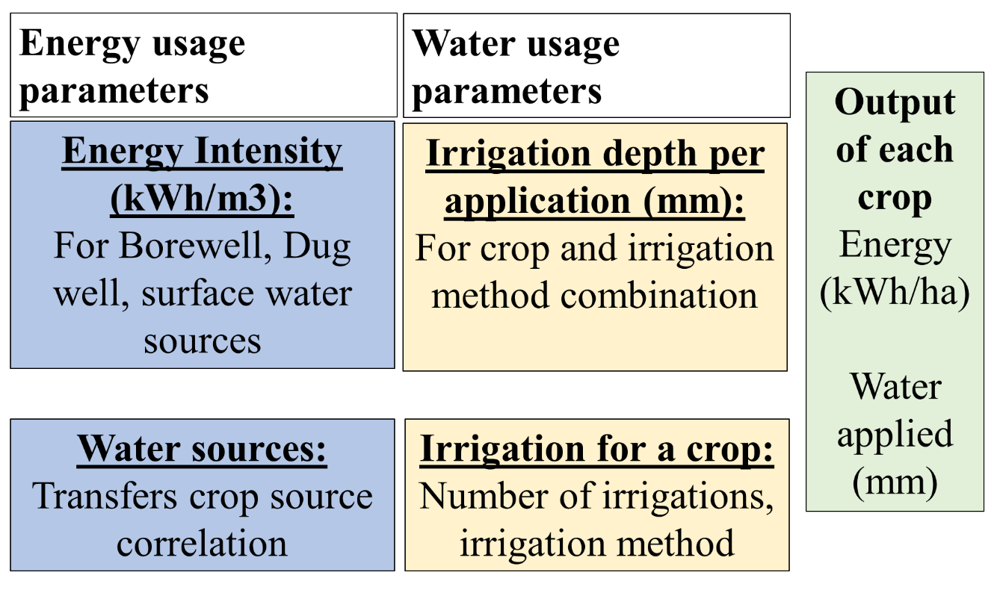
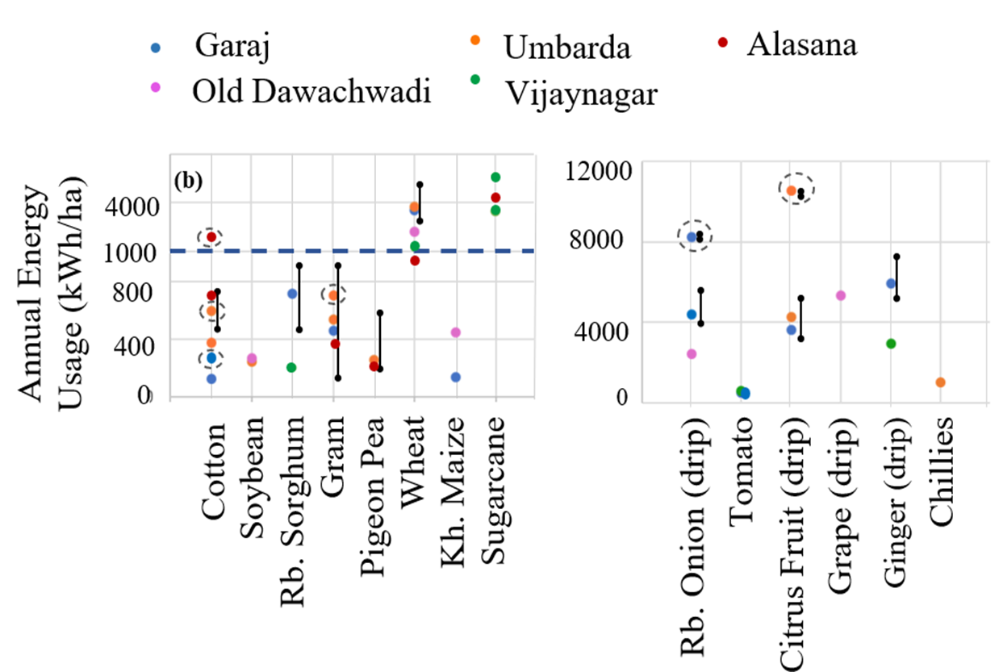
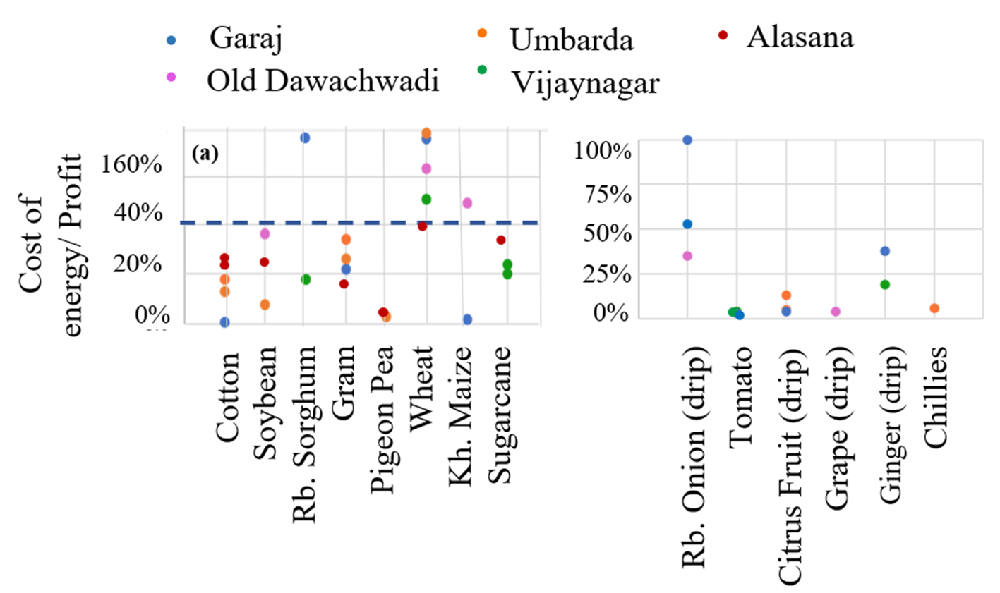
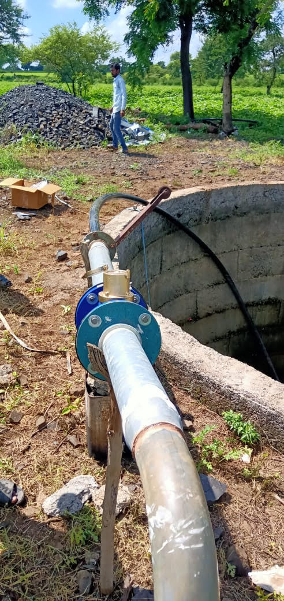

**Modeling of Energy, Water and Crops linkages**

[**Academic work:** PhD Thesis, Namita Sawant, 2017 - 2022]{.mark}

**[Agency: Project on Climate Resilient Agriculture, a project of the Dept. of Agriculture, Gov. of Maharashtra and the World Bank]{.mark}**

**[Project Team: Sameer Kulkarni, Siddhesh Mane,]{.mark}**

**[Students: Namita Sawant,]{.mark}**

[**Download preprint of** \"Methodology to quantify crop, irrigation water, and energy linkages in small-holder irrigation systems\", Namita Sawant, Sameer Kulkarni, Pankaj Sharma, Akanksha Doval, Energy for Sustainable Development. 2025]{.mark}

[**[[Journal download]{.underline}]{.mark}**](https://www.sciencedirect.com/science/article/pii/S0973082625000699?via%3Dihub)

The water, energy , food nexus [(WEFN)]{.mark} is an approach to manage constrained natural resources. An important demand of this approach is tools to conduct quantified analysis of trade-offs and synergies of these resources. [In India, the WEFN discussion is centred around energy subsidies, depleting water levels and poor quality of supply. These issues are being addressed by policies such as net metering, energy pricing, promotion of micro-irrigation, payback schemes for reduced energy usage and energy supply management. Quantification of WEF linkages can be used for analyses of these schemes and policies to improve their efficacy.]{.mark}

This is the first work which quantifies the linkages in a generalized methodology, yet allows for site-specific variations. Many interesting heretofore unquantified results have been found such as irrigation depth per event for various irrigation methods, the energy intensity of borewells and open wells for pressurized and unpressurized irrigation.

> [The methodology is based on a set of parameters that reflect agro-climatology, irrigation technology, and local irrigation practices. These are developed through field-level measurements and observations. The output of the methodology is crop-wise energy usage in kWh/ha and water applied in mm. The study is conducted in Maharashtra. The same methodology may be used in other states.]{.mark}

[The cost of energy for irrigation estimated through this methodology provides inputs for a more realistic economic analysis of the effect of energy pricing on food security and farmer incomes and energy linkages.]{.mark}

{width="3.6041666666666665in" height="2.7160542432195975in"}

[Methodology to quantify crop, irrigation]{.mark}

{width="3.744792213473316in" height="2.51922353455818in"}{width="3.7968755468066493in" height="2.2576017060367453in"}

[Energy usage in kWh/ha and the percentage of the cost of energy as a ratio of profit for the main crops in the state]{.mark}

This methodology has further been developed into a demand model for irrigation energy consumption (see here). This was then used to find the Distribution Transformer capacity requirement in a village and developed into a protocol that was implemented through government processes in 10 villages (see report).

{width="1.6986942257217847in" height="3.5907436570428697in"}

Water meters to measure usage
