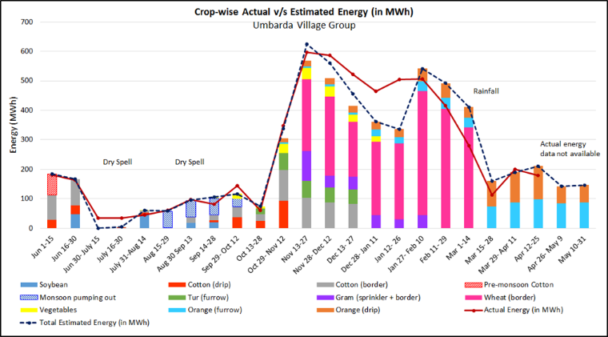

> **Demand modelling of power demand for irrigation**

**[Done as a part of a project for the Project on Climate Resilient Agriculture (PoCRA), Dept. of Agriculture, Gov. of Maharashtra and the World Bank, 2020 - 2025]{.mark}**

[**Academic work:** PhD Thesis, Namita Sawant, 2017 - 2022]{.mark}

This work develops a demand model for power consumption for irrigation based on cropping and irrigation practices. The model is based on a published methodology linking energy and water usage to crops. The model was tested against 7 feeders. Figure 1 illustrates the fortnightly model output and the energy consumption data for one feeder, along with the cropwise split.

{width="5.466720253718285in" height="2.9206036745406823in"}

The model was built into a software module called 'Energy Estimation tool' to estimate the minimum Distribution Transformer (DT) capacity required in a village. The tool was implemented in 10 villages through the official processes of the Department of Agriculture.

The tool is a decision support system, allowing institutional resource governance. It develops protocols to build an important dataset including agroclimatic conditions, technical information, and farmer irrigation practices.
