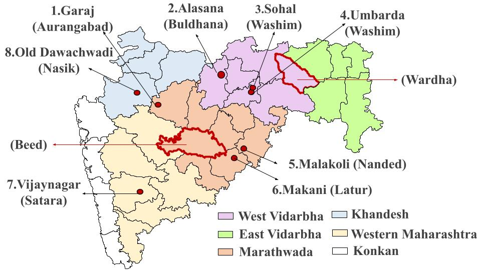
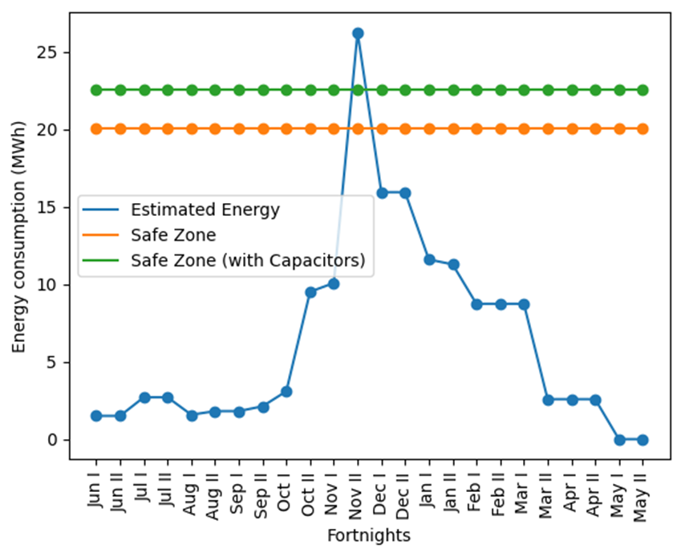
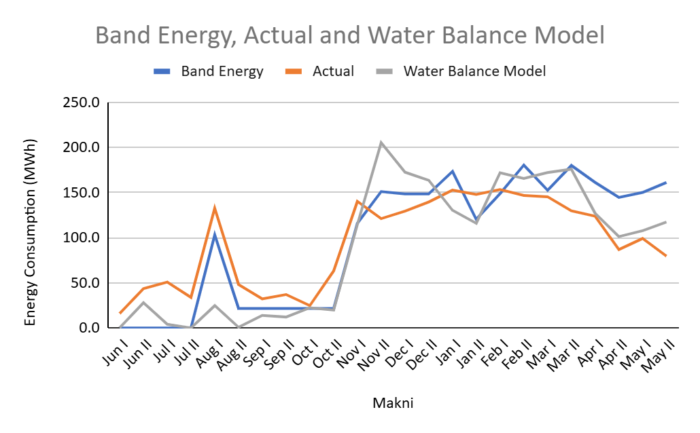
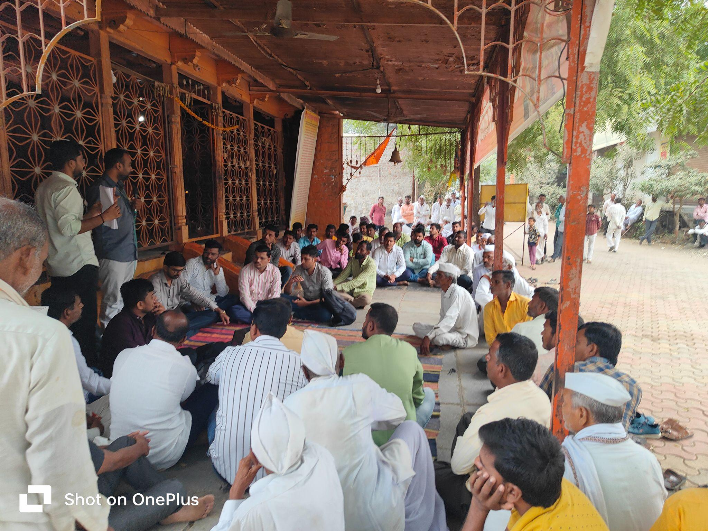

**Energy Estimation Tool**

***[A tool to determine infrastructure capacity based on crop-water-energy Linkages]{.underline}***

*Agency: Project on Climate Resilient Agriculture, a project of the Dept. of Agriculture, Gov. of Maharashtra and the World Bank*

**Period: 2023-24**

**Project team members: Vivek Shinde, Devanand Doifode, Aryan Dangi, Asim**

The government spends a lot (\~1000 crores) annually to extend the agricultural distribution system. However the insufficient electricity infrastructure capacity results in poor quality of supply to farmers and high maintenance costs to the power distribution company. The Energy Estimation Tool (EET) is an innovative solution to determine infrastructure requirements based on crop data.

The tool is based on a methodology quantifying crop, irrigation water, and energy, which was developed through extensive measurements and field-level observations (see 'Methodology on Energy and water estimation by crops'). The EET tool was successfully implemented in 10 villages in the Beed and Wardha districts through government processes. Village-level cropping and other data were collected by village agriculture officers (Krishi Sahayaks). The tool output was discussed in winter meetings (Rabi hangam baithak) attended by farmers, a distribution company representative, and the Krishi Sahayak. Thus promoting Information, Comprehension and Collective action. The outcomes of the EET tool matched with the Distribution Transformer (DT) failure rate in the villages.

EET can be used for infrastructure planning at the village level and upstream, higher-level reporting and intersectoral policy-making (Water-Energy -Food Nexus).

+------------------------------------------------------------------------------------------------------------------------------------------+--------------------------------------------------------------------------------------------------------------------------------------+
| **Testing at the feeder and Feeder level**                                                                                               | **Implemented in 10 Villages**                                                                                                       |
+------------------------------------------------------------------------------------------------------------------------------------------+--------------------------------------------------------------------------------------------------------------------------------------+
| {width="2.25in" height="1.2638888888888888in"}                   | {width="2.182292213473316in" height="1.46875in"}             |
|                                                                                                                                          |                                                                                                                                      |
| *Different locations of pilot studies for building EET*                                                                                  | *The outcome of EET for Rohana Village, Arvi, Wardha*                                                                                |
+------------------------------------------------------------------------------------------------------------------------------------------+--------------------------------------------------------------------------------------------------------------------------------------+
| {width="2.940213254593176in" height="1.8185761154855644in"} | {width="2.4218755468066493in" height="1.7987707786526683in"} |
|                                                                                                                                          |                                                                                                                                      |
| *Comparing EET results with actual data, Makni*                                                                                          | Rabi Hangam Baithaks to present EET result, Rui, Beed                                                                                |
+==========================================================================================================================================+======================================================================================================================================+
