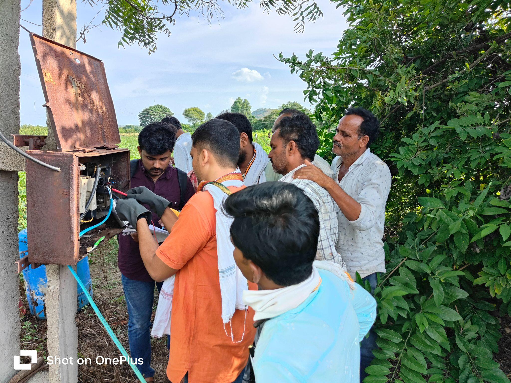
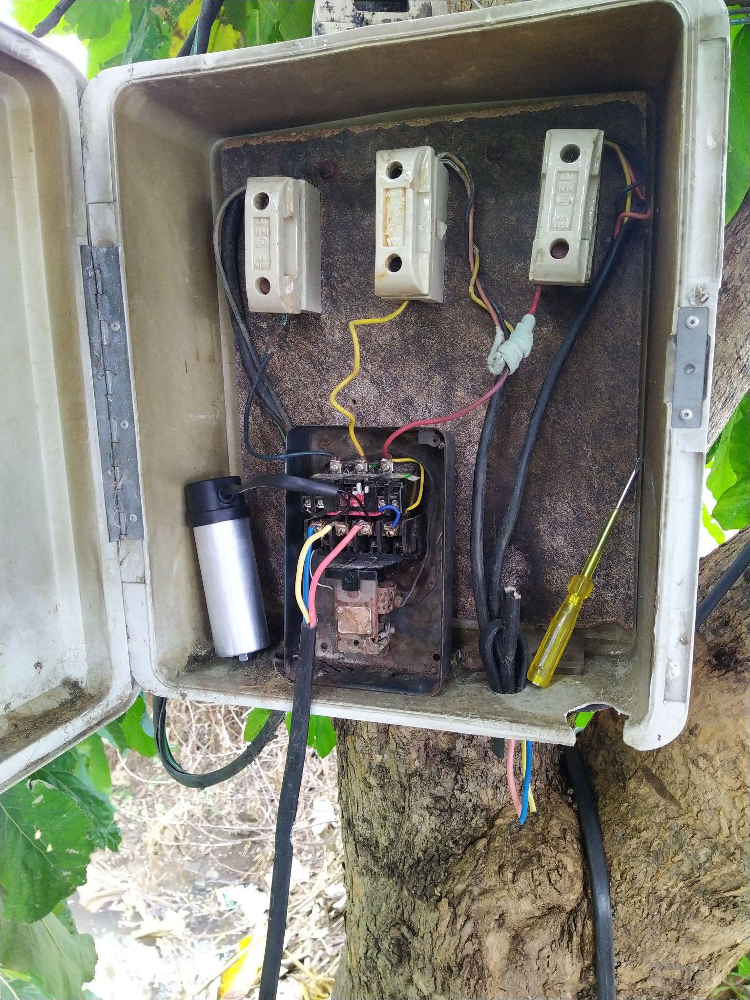
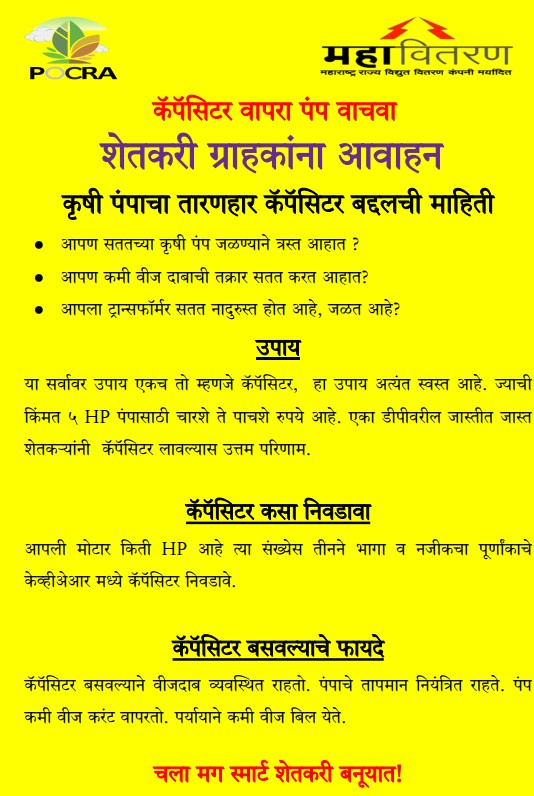

**Capacitor usage with irrigation pumps**

***[\"Small Investment, Big Impact: Improve Irrigation with Capacitors.\"]{.underline}***

**Year - 2014-14, 2023-24**

**People worked - Mehul Raghwan, Vivek Shinde,**

[Poor quality of electricity for irrigation is a major issue for farmers leading to repair expenses, poor water management, extreme inconvenience, and reduced yields. This can be reduced substantially if farmers use capacitors on irrigation pumps.]{.mark}

[Capacitor usage with induction motors is a standard technical solution for power distribution efficiency. is a low-cost, effective, and well-known solution, commonly used in industry yet their usage is non-existent in agriculture.]{.mark}

[This group has conducted several projects over the years to investigate the gaps leading to this untapped resource, technical analysis through simulations, and a structured demonstration project carried out under the Project on Climate Resilient Agriculture (PoCRA) in 10 villages has thrown more light on possible solutions.]{.mark}

[Broadly, capacitor usage can lead to a 5 to 10% improvement in voltage, and 5% reduction in energy loss in the conductors. More importantly, it reduces the probability of Distribution Transformer failure, and tripping incidences at the pump and DT, substantially. The cost of a capacitor is Rs.500 - 750, and it lasts for several years. The lack of usage can be put down to lack of awareness among farmers. 95% of farmers did not know about a capacitor and its benefits. One of the reasons for this may be that when one farmer uses a capacitor the effect is small but it is very significant when the majority of farmers on a DT use a capacitor.]{.mark}

[As a result of the demonstration projects carried out under PoCRA, it was found that farmers in the targeted villages who learnt of the benefits wanted to use capacitors, but they were limited by availability in shops. Hence it is important for the distribution company / vendors to carry out capacitor drives.]{.mark}

[Project reports and presentations, and newspaper articles from this group are listed below.]{.mark}

[Capacitor usage is one direct, simple, and low cost solution that can improve the quality of power supply for farmers, as well as benefit the distribution company. We are happy to provide guidance and inputs to NGOs, capacitor vendors, FPOs, or other groups who are willing to take this forward.]{.mark}

[[Structure demonstration project carried out under PoCRA, 2024]{.underline}](https://drive.google.com/drive/folders/1vc1EFgJnTMKwdnQr2gFpKAPhrcFymAh4?usp=drive_link)

[Design and analysis of a pilot project for power factor improvement on agricultural feeders in Dakshin Haryana, March 2017; Study conducted for Dakshin Haryana Bijli Vitaran Nigam Ltd.]{.mark}

[[Video on capacitor usage]{.underline}](https://www.youtube.com/watch?v=RCPcVEVgTAE)

Newspaper article: [[Beneficial effect of capacitor usage with agricultural pumps, Lokmat, August 2019]{.underline}](https://www.lokmat.com/editorial/capacitors-have-beneficial-effect-agriculture/) , English translation

Publication:

[['Power factor issues on agricultural feeders: Investigated through the case of a village in Sangli, Maharashtra', Selected for Oral/Poster presentation at ICAER 2015; Also presented to the Maharashtra Electricity Regulatory Commission]{.underline}](https://drive.google.com/open?id=1ethVtPLrpGD1xvo-U0ofl5Wjdpbo6W_6)

{width="2.9039238845144357in" height="2.027267060367454in"}

Video on capacitors on the PoCRA channel

{width="3.8074103237095365in" height="3.192367672790901in"}

Demonstrating the voltage increase on capacitor installation

{width="3.9687521872265967in" height="5.291668853893263in"}

Capacitor installed on Irrigation Pump

{width="2.0313451443569552in" height="3.0104166666666665in"}

Sample awareness building material
