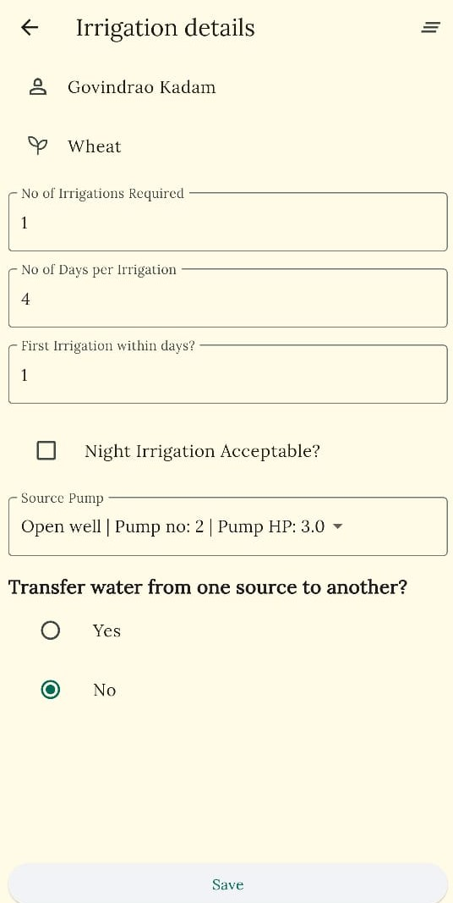
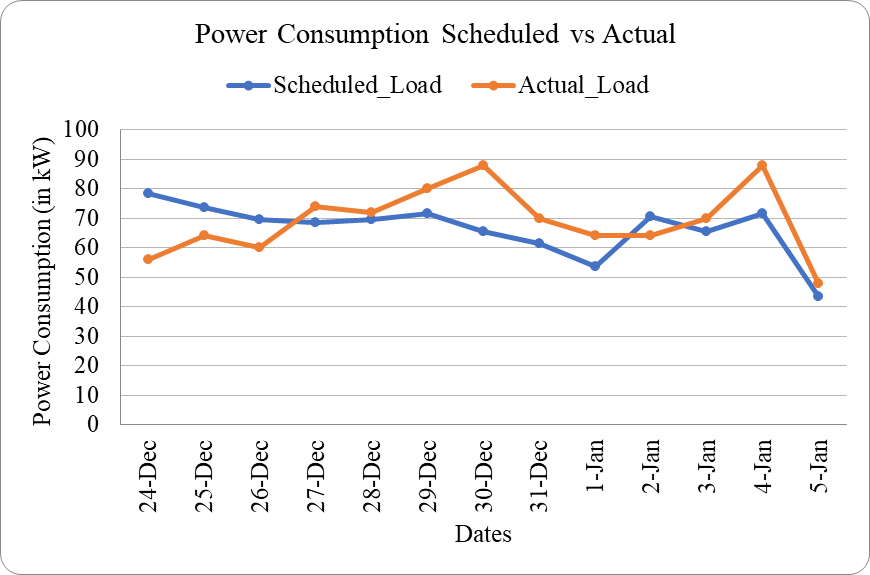
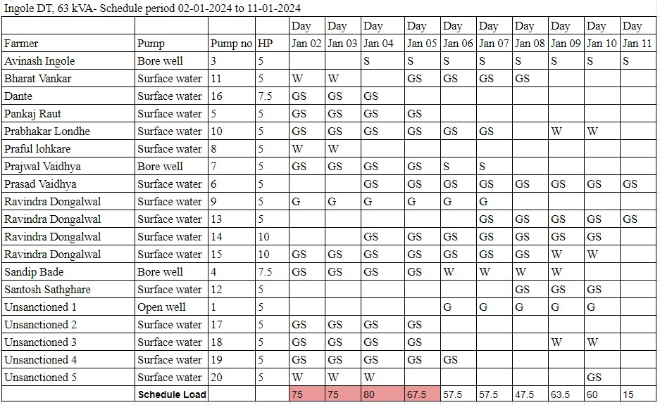

**[Load management at the Irrigation Distribution Transformer]{.mark}**

***[[An app to create a schedule for irrigation by farmers on a Distribution Transformer (DT) in peak season]{.underline}]{.mark}***

*[Agency: Project on Climate Resilient Agriculture, a project of the Dept. of Agriculture, Gov. of Maharashtra and the World Bank]{.mark}*

**[Period: 2021-24]{.mark}**

**[Project Team: Vivek Shinde , Devanand Doifode]{.mark}**

**[Students: Athira Panicker (PhD)]{.mark}**

[During peak Rabi season transformers across the state get overloaded for a few weeks leading to transformer failure, tripping and pump failure. Load management involves scheduling farmers\' irrigation requirements to avoid overloading.]{.mark}

[Farmers create a schedule in groups considering irrigation requirements, and field conditions such as the day-night supply of electricity, water transfers from borewell to openwell, and prioritising critical irrigations. An app has been developed to simplify the generation of irrigation schedules.]{.mark}

[In fact, it has been observed that farmers sometimes use a crude and suboptimal approach where one of two branches of the network operates on alternate days. Instead, this approach ensures a reliable power supply for farmers without compromising on irrigation requirements and irrigation behaviour.]{.mark}

[The load management initiative has been successfully implemented at 11 locations across Vidarbha and Marathwada. The app is currently available under the PoCRA scheme of the Department of Agriculture, Government of Maharashtra.]{.mark}{width="1.6368482064741907in" height="2.821157042869641in"}{width="3.5677088801399823in" height="2.352965879265092in"}

*[Load management at Dhanora Makta Village, Nanded]{.mark} Interface of the load management app*

{width="5.158436132983377in" height="0.9583333333333334in"}

*Schedule generated using the load management app*
