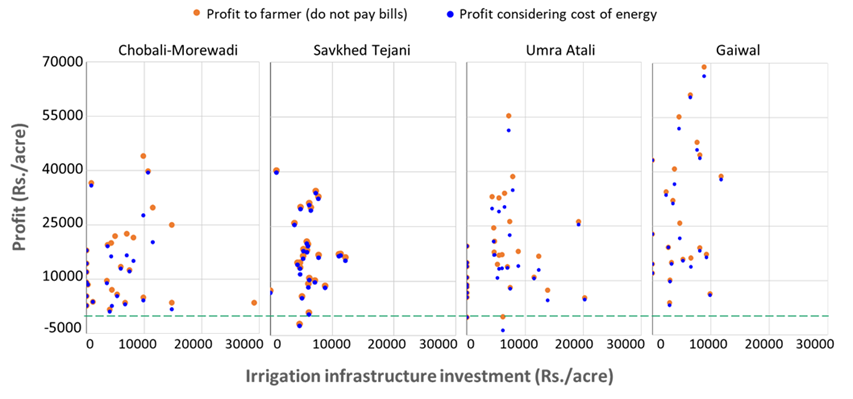

**Irrigation investment Indices**

**\"Irrigation Indices pointed out that farmers need to make Smarter Investments\"**

*Agency: Project on Climate Resilient Agriculture, a project of the Dept. of Agriculture, Gov. of Maharashtra and the World Bank*

**Period: 2021-22**

**People Worked: Devanand Doifode**

Irrigation plays a critical role in enhancing agricultural productivity. In Maharashtra, access to irrigation is important due to variability in Mansson rainfall and to enable rabi cropping.

Farmers are investing in digging wells/borewells and purchasing micro-irrigation equipment, etc., hoping for higher profits through high-valued crops such as sugarcane and horticulture. In this study, We investigated the profitability of different cropping patterns as a function of water sources.

A study was conducted in the Marathwada and Vidarbha regions to understand the economics of irrigation investment. The irrigation investment index is the ratio of profit considering energy to total irrigation cost.

The study was conducted on farmers in four different villages representative of different types of cropping patterns.

{width="6.536781496062992in" height="3.0588790463692037in"}

[The increase in irrigation intensity is accompanied with a mostly decreasing return on investment.]{.mark}
