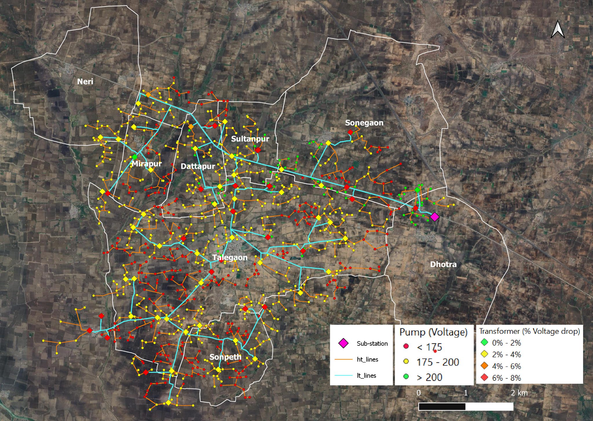

**GIS representation and analysis of water-energy-food linkages in grid based irrigation systems**

Principal Investigators: Priya Jadhav (CTARA), Anil Kulkarni (EE)

Project Team: Tejas Nagotkar, Himanshu Sonare

September 2023 to November 2025

[[Reports and code submitted to DST]{.underline}](https://drive.google.com/drive/folders/1AhdcrDdpQKeMaf1B5omd1URvoiwdnybE?usp=drive_link)

[[Presentation at DST review, January 2025]{.underline}](https://docs.google.com/presentation/d/1zvBNcm-asUhI55oachpIKl7ALUOA21ll/edit?slide=id.p1#slide=id.p1); [[Review comments]{.underline}](https://drive.google.com/drive/folders/1AnpivdtUkoFo20Id4yjRrV5OVop250MN?dmr=1&ec=wgc-drive-globalnav-goto)

Access to a connection, and quality and schedule of power for irrigation is a major problem for farmers. Socio-political issues in this sector have led to a system with poor quality supply for farmers, and losses for distribution utilities. With climate change and unpredictable rainfall, protective irrigation is becoming imperative for all farmers. Solutions to address issues are being sought through newer technical paradigms such as offgrid solar photovoltaic pumps, High Voltage Distribution Systems (HVDS) etc. On the other hand, balancing the conflicting objectives of reducing irrigation water and energy usage, increasing food security, and farmer income, have become very important in India. Effective policy design, as well as promoting operational efficiency in the system, requires analysis through systems representing water energy-food linkages at the local level[(Sawant et al., 2025)](https://www.zotero.org/google-docs/?hSmlQL).

This project addresses this need by documenting the electrical distribution system of agricultural feeders in GIS and connecting it to the cropping patterns and water sources. Thus setting up a system which may be used for design and analysis while optimizing resources and farmer requirements.

{width="5.985948162729659in" height="4.643073053368329in"}

**Talegaon Feeder, Wardha**
