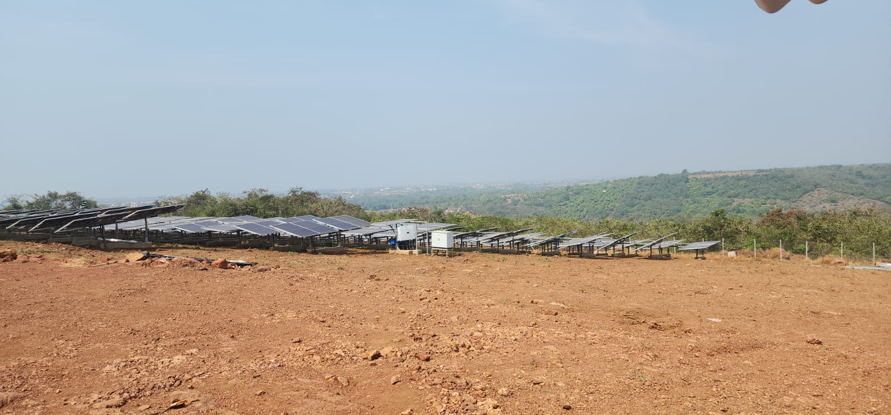

Study of 1 MW solar plant in Golap Ratnagiri

Project from: CEO, Zilla Parishad, Ratnagiri District, Maharashtra

Principal Investigators: Priya Jadhav (CTARA), Narendra Shiradkar (EE)

Several government schemes are being implemented to promote 1 to 10 MW scale solar PV plants connected at 11 kV or 33 kV level. For example the PM-KUSUM scheme, component C promotes solar Ag feeders.

This was a study of a 1 MW scale solar PV plant in Golap, Ratnagiri. A technical analysis of the plant was conducted through observations, SCADA data analysis and simulations. Suggestions were made to the agency for incorporation in future implementations / DPRs of such plants.

[[See Report here.]{.underline}](https://drive.google.com/file/d/1bqNg8dxGUeFaqTp6nOWDuIxMoyTe_Cm7/view?usp=drive_link) [[Appendix A.]{.underline}](https://drive.google.com/file/d/1xPC2KpBOsJSlbKcOshtCIsHtNV3A5kkl/view?usp=drive_link)

{width="5.552119422572178in" height="1.8373917322834645in"}
